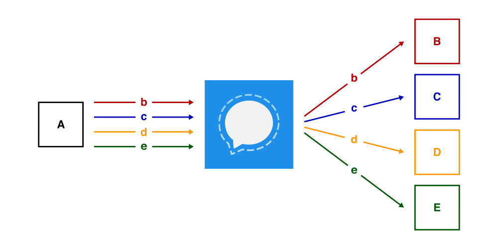
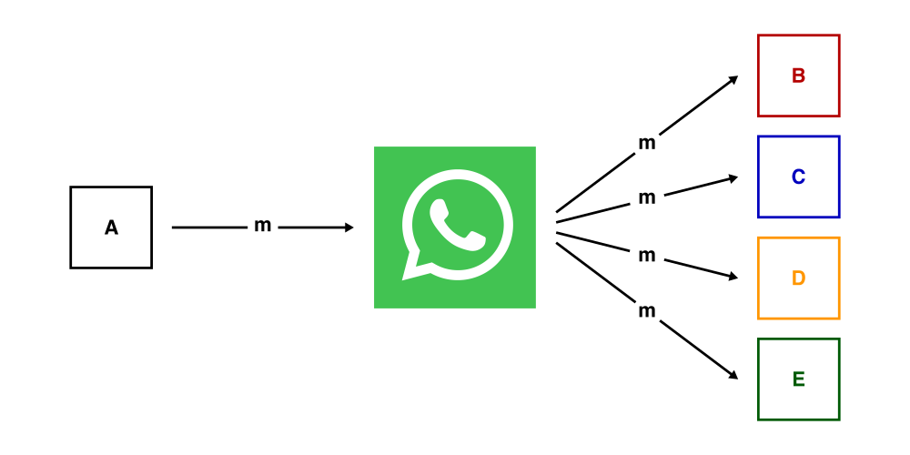
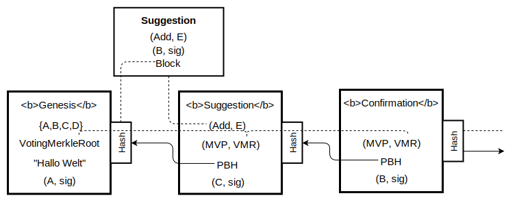
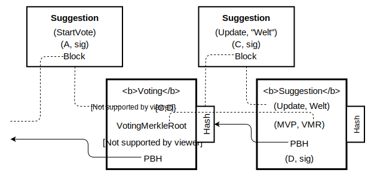

<!-- _paginate: false -->
<!-- _footer: "" -->
<!-- _header: "" -->
# Decentral Groupmanagement in Messengers with Delegated Proof of Stake

AndHell - 12.09.2019

---
<!-- _footer: "" -->

# Index
- Basics
- Idea
- Design
- Simulation
- Result

---
<!-- _footer: "" -->
<!-- _header: "" -->
<!-- _paginate: false -->
# Basics
- Groupchats
    - Signal
    - WhatsApp
- Delegated Proof of Stake (DPoS)
---
<!-- footer: "**Basics** - Idea - Design - Simulation - Result" -->
# Groupchats

Message thread with multiple participants

Asynchornous

$gr = (\textit{Id}_{gr}, \mathcal{M}_{gr}, \mathcal{M}^*_{gr}, \textit{info}_{gr})$

---
## Clossness

## Privacy

## Same State

---

---
 

---
# Delegated Proof of Stake

    

        
    

    

    
    

---
# Delegated Proof of Stake

- Members **elect** *Delegates*
    - Votes are attached to Transactions
    - Votes can be shared at any time
    - Count votes every N blocks
- *Delegates* build blocks
    - Signing of *Transactions*
    - Predefined order

---
<!-- _footer: ""-->
<!-- _paginate: false -->
<!-- _header: "" -->
# Idea

---
<!-- footer: "Basics - **Idea** - Design - Simulation - Result" -->
# Idea

Groupmanagment with Delegates Proof of Stake

- Decentral Management
    - No central Server
    - No *Admins*
    - Suggestion + Confirmation
- Groupstate secured by a Blockchain

---

<!-- _footer: "" -->
<!-- _paginate: false -->
<!-- _header: "" -->
# Design

- Blockchain
- Voting
---
<!-- footer: "Basics - Idea - **Design** - Simulation - Result" -->
# Basics

### User
- unique ID  ${A, B, C, D, ...}$
- Public Keys are known

### Group
- Message delivery as in Signal
- Private

---
# Blockchain

Datastructure for the histroy of a Group

- by hashes chained list of signed blocks
- Information
    - Members
    - Meta Information (Name, Picture, ...)
    - Delegates

---

# Blocks

- GenesisBlock
- SuggestionBlock
- ConfirmationBlock
- VotingBlock

---

---

---
# Forks

---
# Forks

---

# Voting
- *Election Days*
- Can be started by everyone

- Two Timeframes
    - Voting Window 
$vote = ([M], mr, sig_{mr})$
    - Collection Window
$vResult = ([M], mr, sig_{mr}, [vote])$

---

<!-- _footer: "" -->
<!-- _paginate: false -->
<!-- _header: "" -->
# Simulation

---
<!-- footer: "Basics - Idea - Design - **Simulation** - Result" -->
# Technologie
- Console application
- C# (dotnetcore)
- libsodium
- RabbitMQ

---
# Clients

- sleep
- process new messages
- Action requiered?
    - Voting
    - Sign Suggestion
- [Optional] send random Suggestion

---
<!-- _footer: "" -->
<!-- _paginate: false -->
<!-- _header: "" -->
# Result

---
<!-- footer: "Basics - Idea - Design - Simulation - **Result**" -->

## Clossness

## Privacy

## Same State

---

# Result - Voting

- scalability for large groups
- synchronous
- public votes

## 
- asynchronous Voting

---
# Result - Forks
- Information loss
- Can be exploited by delegates

##
- server-side-timestamp
- Fork unification

---

<!-- footer: ""-->
<!-- paginate: false -->
<!-- header: ""-->

# Conclusion

---

\<\/Slides\>